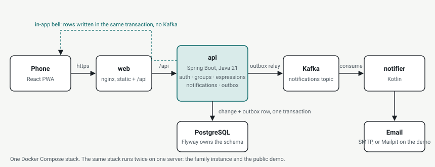

# Express & Possess

Wish lists for a group. Members write down what they want; other members take care of it.
Built for one family, published as a portfolio project.

Specification: [docs/spec-v3.html](docs/spec-v3.html). Build order: [docs/plan.md](docs/plan.md).
Which file does what: [docs/code-guide.md](docs/code-guide.md).



## Parts

| Module | What it is |
|---|---|
| `api` | Spring Boot 3, Java 21. Accounts, groups, expressions, comments, in-app notifications, and the outbox that feeds Kafka. One deployable. |
| `notifier` | Spring Boot, Kotlin. Consumes the `notifications` topic and sends email. Telegram is planned. |
| `web` | React, TypeScript, Vite. Mobile-first progressive web app; installs to the phone's home screen. |

## Why Kafka for a family of four

It is not needed. A Spring application event would carry a notification from the API to an
email sender inside one process, and for one deployment that would be the right call.

Kafka is here because the project is also a portfolio piece, and it is used the way it would
be in a system that did need it: the API never talks to Kafka inside a request. Every change
writes an `outbox_events` row in the same database transaction as the change, and a small
publisher relays unpublished rows to the topic and stamps them. A notification is therefore
never sent for a change that rolled back, and never lost when the broker is down; it is
delivered at least once, and the consumer tolerates a repeat. The in-app bell does not go
through Kafka at all, because its rows must be consistent with the change they announce,
so they are written in the same transaction too.

## The one race worth reading

Two members can press “I’ll take care of it” on the same wish at the same moment. The claim is one
conditional update, `UPDATE ... WHERE implementer_id IS NULL AND status = 'EXPRESSED'`, so
the database changes a row for exactly one of them; the other gets zero rows and a 409.
No locks, no retries. `TakeCareConcurrencyTest` fires twenty members at once and asserts
one winner.

## The demo

The same stack runs twice on one server: the private family instance and a public demo
seeded with a fictional family. The demo's login page has "Log in as Alice / Bob / Carol"
buttons, its emails land in a Mailpit inbox reviewers can open, and everything is wiped
and reseeded every night. Deployment: [docs/deploy.md](docs/deploy.md).

To run the demo mode locally, start the API with `APP_DEMO_ENABLED=true`.

## Run locally

Docker Desktop must be running.

```bash
docker compose up -d
mvn -pl api spring-boot:run
```

In a second terminal:

```bash
mvn -pl notifier spring-boot:run
```

And the web app, which proxies `/api` to the API:

```bash
cd web && npm install && npm run dev
```

Open http://localhost:5173 on a phone-sized window.

To get the administration page, start the API with `APP_ADMIN_EMAILS=you@example.com` and
register with that address. Administrators can then promote other accounts.

The API listens on http://localhost:8080, the notifier's health endpoint on
http://localhost:8081/actuator/health. Emails the application sends are caught by Mailpit
at http://localhost:8025.

## Test

Tests run against a real PostgreSQL, Kafka, and Mailpit started by Testcontainers, so
Docker must be running.

```bash
mvn verify
```

Web app tests and type check:

```bash
cd web && npm test && npm run typecheck
```
