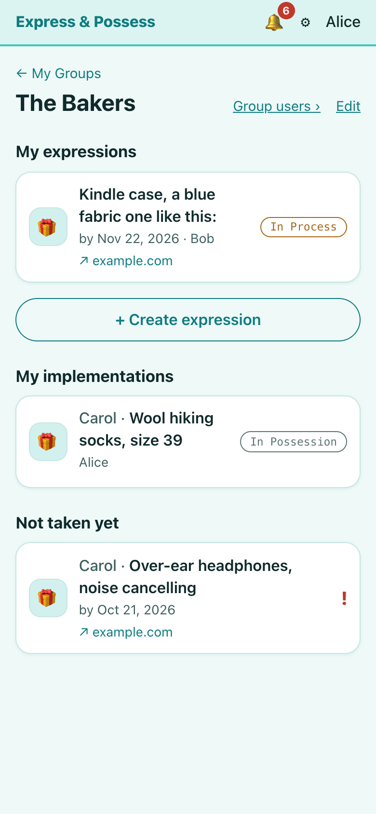
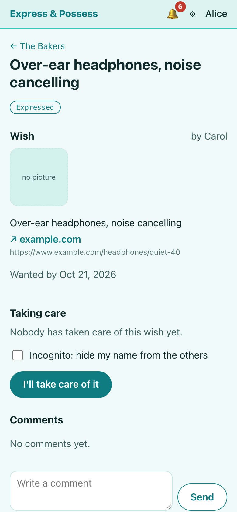
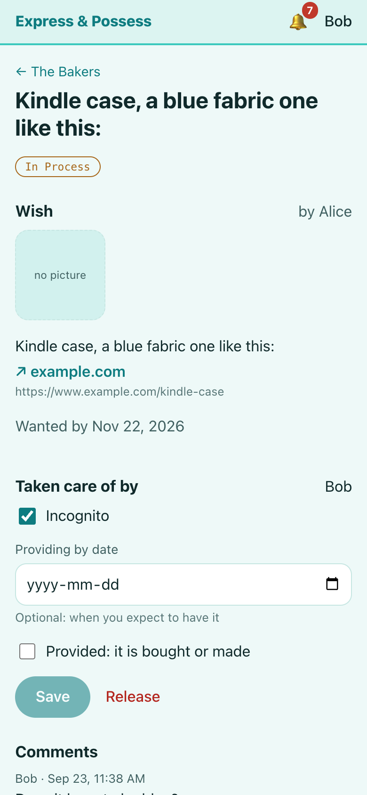

# Express & Possess

A shared wish list for a group of people. Members say what they want, and the others help make it
happen.

**Try it:** [demo.expresspossess.glotov.ca](https://demo.expresspossess.glotov.ca), with no sign-up:
press "Log in as Alice", Bob or Carol. The demo's emails arrive in its own inbox,
[mail.demo.expresspossess.glotov.ca](https://mail.demo.expresspossess.glotov.ca), and everything resets
every night.

**Use it:** [expresspossess.glotov.ca](https://expresspossess.glotov.ca) is the live site; anyone can
register and start a group. On a phone it installs to the home screen like an app.

<p>
  
  
  
</p>

## What it is for

- 🎁 **Family and friends.** Everyone writes down what they would like for a birthday or the
  holidays. The others pick something to give, and nobody ends up buying the same present twice.
- 💍 **Weddings and baby showers.** The couple lists the gifts they hope for and shares a link with
  the guests. Each guest reserves the gift they will bring, and everyone sees what is still free.
- 💻 **At work.** Staff ask for a laptop, a monitor, a licence or access to a system. The right
  department takes the request, marks it done when it is ready, and the person confirms it arrived.
- ✅ **Shared to-do lists.** Chores at home, tasks for volunteers, jobs before a move. People take
  on the tasks they can do, and the list shows who is doing what.

## How it works

1. **Create a group.** Invite people by email, or share a link anyone can join with.
2. **Express a wish.** Describe it, add shop links and a picture, and say when you would like it by.
3. **Someone takes care of it.** A member presses "I'll take care of it". Only one person can, so
   nothing is done twice. They can stay incognito to keep a surprise.
4. **Provided.** When it is bought, made or done, they mark it provided.
5. **In possession.** You confirm "Received with thanks", and the wish is fulfilled.

The group hears about every new wish, and you hear about each step of yours, in the app and by
email. Each wish has its own comments for questions such as size or colour. Groups are private:
only their members see the wishes. On a phone the site installs to the home screen and opens like
an app.

## The project

I built it for my family and publish it as a portfolio project.

Specification: [docs/spec-v3.html](docs/spec-v3.html). Build order: [docs/plan.md](docs/plan.md).
Which file does what: [docs/code-guide.md](docs/code-guide.md).


## Parts

| Module | What it is |
|---|---|
| `api` | Spring Boot 3, Java 21. Accounts, groups, expressions, comments, in-app notifications, and the outbox that feeds Kafka. One deployable. |
| `notifier` | Spring Boot, Kotlin. Consumes the `notifications` topic and sends email. Telegram is planned. |
| `web` | React, TypeScript, Vite. Mobile-first progressive web app; installs to the phone's home screen. |

## Why Kafka for a family of four

It is not needed. A Spring application event would carry a notification from the API to an
email sender inside one process, and for one deployment that would be the right call.

Kafka is here because the project is also a portfolio piece, and it is used the way it would
be in a system that did need it: the API never talks to Kafka inside a request. Every change
writes an `outbox_events` row in the same database transaction as the change, and a small
publisher relays unpublished rows to the topic and stamps them. A notification is therefore
never sent for a change that rolled back, and never lost when the broker is down; it is
delivered at least once, and the consumer tolerates a repeat. The in-app bell does not go
through Kafka at all, because its rows must be consistent with the change they announce,
so they are written in the same transaction too.

## The one race worth reading

Two members can press “I’ll take care of it” on the same wish at the same moment. The claim is one
conditional update, `UPDATE ... WHERE implementer_id IS NULL AND status = 'EXPRESSED'`, so
the database changes a row for exactly one of them; the other gets zero rows and a 409.
No locks, no retries. `TakeCareConcurrencyTest` fires twenty members at once and asserts
one winner.

## The demo

The same stack runs twice on one server: the main site
([expresspossess.glotov.ca](https://expresspossess.glotov.ca)), where anyone can register and groups
stay private to their members, and a public demo
([demo.expresspossess.glotov.ca](https://demo.expresspossess.glotov.ca)) seeded with a fictional
family. The demo's login page has "Log in as Alice / Bob / Carol" buttons, its emails land in a
Mailpit inbox reviewers can open, and everything is wiped and reseeded every night. Both run on an
Oracle Cloud server behind Caddy. Deployment: [docs/deploy.md](docs/deploy.md).

To run the demo mode locally, start the API with `APP_DEMO_ENABLED=true`.

## Run locally

Docker Desktop must be running.

```bash
docker compose up -d
mvn -pl api spring-boot:run
```

In a second terminal:

```bash
mvn -pl notifier spring-boot:run
```

And the web app, which proxies `/api` to the API:

```bash
cd web && npm install && npm run dev
```

Open http://localhost:5173 on a phone-sized window.

To get the administration page, start the API with `APP_ADMIN_EMAILS=you@example.com` and
register with that address. Administrators can then promote other accounts.

The API listens on http://localhost:8080, the notifier's health endpoint on
http://localhost:8081/actuator/health. Emails the application sends are caught by Mailpit
at http://localhost:8025.

## Test

Tests run against a real PostgreSQL, Kafka, and Mailpit started by Testcontainers, so
Docker must be running.

```bash
mvn verify
```

Web app tests and type check:

```bash
cd web && npm test && npm run typecheck
```
