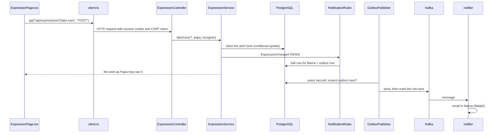

# A guide to the code

Which file does what, following the things a family member does in the app. Paths are relative to the
project folder; the links open in IntelliJ.

The picture of the whole system is [architecture.svg](architecture.svg). The rules the code follows
are in the specification, [spec-v3.html](spec-v3.html).

## 1. The parts

| Folder | What it is | Written in | Where it runs locally |
|---|---|---|---|
| [`web`](../web) | The website people see: every page and button | TypeScript, React | Vite, on port 5173 |
| [`api`](../api) | The server: logins, groups, wishes, comments, the bell, and all the rules | Java, Spring Boot | Maven or the IDE, on port 8080 |
| [`notifier`](../notifier) | Sends notification emails | Kotlin, Spring Boot | Optional; `mvn -pl notifier spring-boot:run` |
| [`docker-compose.yml`](../docker-compose.yml) | The helpers the server needs: the PostgreSQL database, Kafka, and Mailpit | | Docker Desktop |
| [`deploy`](../deploy), [`Dockerfile`](../Dockerfile), [`web/Dockerfile`](../web/Dockerfile) | Running the whole thing on a real server | | Not used locally; see [deploy.md](deploy.md) |
| [`.github/workflows/ci.yml`](../.github/workflows/ci.yml) | Builds and tests everything on GitHub after each push | | GitHub, once the project is there |

What each helper in Docker is for:

- **PostgreSQL** keeps all the data: accounts, groups, wishes, comments, notifications.
- **Kafka** is a message queue. The server puts "someone should be told about this" messages on it,
  and the notifier takes them off and sends emails.
- **Mailpit** pretends to be a mail server. It catches every email the app sends so you can read them
  at http://localhost:8025 instead of them reaching real inboxes.

## 2. One click, start to finish

Following one action through every layer shows how the parts fit. Here Papa presses **I’ll take care of it** on
Mama's wish.

1. **The page.** [`ExpressionPage.tsx`](../web/src/pages/ExpressionPage.tsx) draws the button. Pressing
   it calls a function from [`queries.ts`](../web/src/api/queries.ts), which calls `api()` in
   [`client.ts`](../web/src/api/client.ts). `client.ts` is the only file in the website that talks to
   the server.
2. **Vite passes it on.** The browser sent the request to port 5173. Vite forwards anything starting
   with `/api` to the server on port 8080 ([`vite.config.ts`](../web/vite.config.ts)).
3. **Security.** [`SecurityConfig.java`](../api/src/main/java/ca/glotov/expresspossess/auth/SecurityConfig.java)
   checks that Papa is logged in and that the request carries the CSRF token, which proves it came
   from our own page rather than from another website.
4. **The controller.** [`ExpressionController.java`](../api/src/main/java/ca/glotov/expresspossess/expressions/ExpressionController.java)
   turns the address `POST /api/expressions/{id}/take-care` into a Java method call. Controllers only
   translate between web requests and Java; they hold no rules.
5. **The service.** [`ExpressionService.takeCare`](../api/src/main/java/ca/glotov/expresspossess/expressions/ExpressionService.java)
   holds the rules: you can't take care of your own wish, and only one person can win. If Papa and
   Grandma press at the same moment, the database updates the wish for only one of them and the
   other is told "Someone else has already taken care of this wish".
6. **The database.** [`ExpressionRepository.java`](../api/src/main/java/ca/glotov/expresspossess/expressions/ExpressionRepository.java)
   holds the queries. Spring writes most of them from the method names; `claim` is written out by
   hand.
7. **Telling people.** The service announces "this wish was taken" (`ExpressionChanged`).
   [`NotificationRules.java`](../api/src/main/java/ca/glotov/expresspossess/notifications/NotificationRules.java)
   decides who hears about it, and
   [`NotificationService.java`](../api/src/main/java/ca/glotov/expresspossess/notifications/NotificationService.java)
   writes two things in the same database transaction as the change: a row for Mama's bell, and a
   row in the outbox table for email. If the change fails, neither row is written.
8. **The answer.** The service returns an `ExpressionView`, the wish as Papa is allowed to see it,
   and the page redraws.
9. **The email, a moment later.** [`OutboxPublisher.java`](../api/src/main/java/ca/glotov/expresspossess/outbox/OutboxPublisher.java)
   checks the outbox every second and sends new rows to Kafka. The notifier's
   [`NotificationConsumer.kt`](../notifier/src/main/kotlin/ca/glotov/expresspossess/notifier/NotificationConsumer.kt)
   receives them and [`EmailChannel.kt`](../notifier/src/main/kotlin/ca/glotov/expresspossess/notifier/EmailChannel.kt)
   emails everyone who has email switched on.

Nearly every action follows this same path. The sections below say which files are involved in each.

## 3. The server, folder by folder

Everything is under [`api/src/main/java/ca/glotov/expresspossess`](../api/src/main/java/ca/glotov/expresspossess).
Each folder covers one subject, and most contain the same kinds of file:

| File name ends in | Job |
|---|---|
| `Controller` | Web addresses (`GET`, `POST`, ...) turned into method calls |
| `Service` | The rules |
| `Repository` | Reading and writing the database |
| No ending (`User`, `Group`, `Expression`) | One database table as a Java class |
| `View`, `Detail`, `Summary`, `Response` | What is sent back to the website |
| `Changed`, `Event` | Announcements other folders can react to |

| Folder | Covers |
|---|---|
| `auth` | Accounts: register, log in, profile, password change and reset, the password rule, security |
| `groups` | Groups, members, invitations, share links, close and archive |
| `expressions` | Wishes, their stages, comments, pictures, link previews |
| `notifications` | Who is told what, and the bell |
| `outbox` | Handing notifications to Kafka safely |
| `admin` | The Administration page |
| `demo` | The public demo with Alice, Bob and Carol |
| `settings` | Site settings changed on the Administration page |
| `contact` | Contact us: messages from members to the site administrators |
| `common` | Shared helpers: errors, settings, email sending, links in text, random tokens |

Settings, such as the database address and the mail server, are in
[`application.yml`](../api/src/main/resources/application.yml). A value written as
`${DB_PASSWORD:expresspossess}` can be replaced by an environment variable of that name, which is how
the real server gets its own passwords.

## 4. What happens where

### Registering and logging in

| Step | Website | Server |
|---|---|---|
| Register | [`RegisterPage.tsx`](../web/src/pages/RegisterPage.tsx) | [`AuthController`](../api/src/main/java/ca/glotov/expresspossess/auth/AuthController.java) → [`AccountService.register`](../api/src/main/java/ca/glotov/expresspossess/auth/AccountService.java) |
| Password rule and repeat field | [`NewPassword.tsx`](../web/src/components/NewPassword.tsx) | [`PasswordRule.java`](../api/src/main/java/ca/glotov/expresspossess/auth/PasswordRule.java) |
| Log in, log out | [`LoginPage.tsx`](../web/src/pages/LoginPage.tsx), `useLogout` in `queries.ts` | `AuthController`; Spring Security handles log out |
| Who is logged in | `useMe` in `queries.ts`; `RequireAuth` in [`App.tsx`](../web/src/App.tsx) sends visitors to the login page | [`AccountController`](../api/src/main/java/ca/glotov/expresspossess/auth/AccountController.java) `GET /api/me` |
| Profile, password change | [`ProfilePage.tsx`](../web/src/pages/ProfilePage.tsx) | `AccountController` → `AccountService` |
| Forgot password | [`PasswordResetPages.tsx`](../web/src/pages/PasswordResetPages.tsx) | `AccountService.requestPasswordReset` emails a link; [`PasswordResetToken`](../api/src/main/java/ca/glotov/expresspossess/auth/PasswordResetToken.java) remembers it |
| Site administrator role | The ⚙ link in [`Layout.tsx`](../web/src/components/Layout.tsx) | `APP_ADMIN_EMAILS` in `application.yml`, applied in `AccountService.register` |

Passwords are stored only as scrambled hashes, never as typed. The server remembers a logged-in
person through a session cookie.

### Groups and members

| Step | Website | Server |
|---|---|---|
| My Groups list with New / Working / Closed | [`GroupsPage.tsx`](../web/src/pages/GroupsPage.tsx) | [`GroupController`](../api/src/main/java/ca/glotov/expresspossess/groups/GroupController.java) → [`GroupService`](../api/src/main/java/ca/glotov/expresspossess/groups/GroupService.java); stages worked out in [`GroupSummary.java`](../api/src/main/java/ca/glotov/expresspossess/groups/GroupSummary.java) |
| Create, rename, close, archive, delete | [`GroupEditPage.tsx`](../web/src/pages/GroupEditPage.tsx) | `GroupService` |
| Invite by email | `GroupEditPage.tsx` (Invite) | `GroupService` adds an existing account at once, otherwise saves a [`GroupInvitation`](../api/src/main/java/ca/glotov/expresspossess/groups/GroupInvitation.java) and emails the link |
| Share link | `GroupEditPage.tsx` (ShareLink) | `GroupService.setShareLink` |
| Opening an invitation or share link | [`JoinPages.tsx`](../web/src/pages/JoinPages.tsx) | [`JoinController`](../api/src/main/java/ca/glotov/expresspossess/groups/JoinController.java) |
| Remove a member, leave, hand over | `GroupEditPage.tsx` (Members) | `GroupService`; `MemberLeftEvent` makes `ExpressionService.onMemberLeft` release that person's wishes |
| Members list, one member's wishes | [`GroupUsersPage.tsx`](../web/src/pages/GroupUsersPage.tsx), [`MemberExpressionsPage.tsx`](../web/src/pages/MemberExpressionsPage.tsx) | `GroupController`, `ExpressionController` |

Invitation and password reset emails go straight to the mail server from
[`EmailService.java`](../api/src/main/java/ca/glotov/expresspossess/common/EmailService.java), without
Kafka, because the person has to receive them right away.

### A wish, from Expressed to In Possession

The four stages are listed in [`ExpressionStatus.java`](../api/src/main/java/ca/glotov/expresspossess/expressions/ExpressionStatus.java).
Each move between them is one method in `ExpressionService`:

| What happens | Stage afterwards | Who can do it | `ExpressionService` method |
|---|---|---|---|
| Write a wish | Expressed | Any member | `create` |
| Change the description or date | Expressed | The creator | `editWish` |
| Take care of it (optionally Incognito) | In Process | Anyone but the creator | `takeCare` |
| Change Incognito or the providing date | In Process | The helper | `editCare` |
| Release | Expressed | The helper | `release` |
| Mark provided | Provided | The helper | `editCare` with provided |
| Mark received | In Possession | The creator | `markReceived` |
| Delete | (gone) | The creator | `delete` |
| Set any stage, with a reason | Any | Site administrator; group admin in an open group | `manageStatus` |
| Delete whatever the stage, with a reason | (gone) | Site administrator; group admin in an open group | `manageDelete` |

The pages involved:

- [`ActivityPage.tsx`](../web/src/pages/ActivityPage.tsx): a group's page with its three lists of
  wishes. The rows are drawn by [`ExpressionRow.tsx`](../web/src/components/ExpressionRow.tsx).
- [`NewExpressionPage.tsx`](../web/src/pages/NewExpressionPage.tsx): writing a wish.
- [`ExpressionPage.tsx`](../web/src/pages/ExpressionPage.tsx): one wish, with editing, taking care,
  Release, Provided, Received, Delete and comments.
- [`ConfirmDialog.tsx`](../web/src/components/ConfirmDialog.tsx): the "Are you sure?" box used before
  deleting, releasing, removing or closing.
- [`StatusChip.tsx`](../web/src/components/StatusChip.tsx): the coloured stage labels.
- [`ManageWish.tsx`](../web/src/components/ManageWish.tsx): the admin's stage and delete controls, shown
  on the Administration page and, for the group admin, at the bottom of `ExpressionPage.tsx`.

Who sees what is decided on the server, in the part of `ExpressionService` that builds an
[`ExpressionView`](../api/src/main/java/ca/glotov/expresspossess/expressions/ExpressionView.java). The
`can...` values in it tell the page which buttons to show; the server checks the same rules again when
a button is pressed. A hidden helper is sent to everyone else as "Incognito", so their name never
reaches the other members' browsers.

When two people edit the same wish at once, the version number in
[`Expression.java`](../api/src/main/java/ca/glotov/expresspossess/expressions/Expression.java) catches
it: the second save is refused rather than silently overwriting the first.

### Comments

Written on `ExpressionPage.tsx`, saved by `ExpressionService.comment` into the
[`Comment`](../api/src/main/java/ca/glotov/expresspossess/expressions/Comment.java) table. When an
administrator or the group admin sets a stage, `manageStatus` adds a note with the reason to the same
list (`systemNote`). Links in a comment are shown as links by `LinkedText` in
[`links.tsx`](../web/src/components/links.tsx).

### Pictures and links

| Step | Website | Server |
|---|---|---|
| Choose or take a photo | `NewExpressionPage.tsx`, `ExpressionPage.tsx`; [`image.ts`](../web/src/components/image.ts) shrinks it and turns iPhone photos into JPEG before upload | `ExpressionController` `POST /api/expressions/{id}/picture` → [`FileStorage.java`](../api/src/main/java/ca/glotov/expresspossess/expressions/FileStorage.java) saves it to the `uploads` folder |
| Show a picture | `` tags | [`FileController.java`](../api/src/main/java/ca/glotov/expresspossess/expressions/FileController.java), logged-in members only |
| Links in the description | [`links.tsx`](../web/src/components/links.tsx) finds them and shows them under the text | [`Links.java`](../api/src/main/java/ca/glotov/expresspossess/common/Links.java), with the same rules |
| Preview card while typing | [`LinkPreviewCard.tsx`](../web/src/components/LinkPreviewCard.tsx); [`useDebounced.ts`](../web/src/components/useDebounced.ts) waits half a second after typing stops | [`LinkPreviewController`](../api/src/main/java/ca/glotov/expresspossess/expressions/LinkPreviewController.java) → [`LinkPreviews.java`](../api/src/main/java/ca/glotov/expresspossess/expressions/LinkPreviews.java), which remembers each link for an hour |
| Reading the shop page | | [`LinkPreviewFetcher.java`](../api/src/main/java/ca/glotov/expresspossess/expressions/LinkPreviewFetcher.java) finds the product title and picture, and refuses addresses inside a home or company network |
| Picture from the link when none is uploaded | `queries.ts` asks again every 3 seconds while the picture is on its way | [`LinkPreviewService.java`](../api/src/main/java/ca/glotov/expresspossess/expressions/LinkPreviewService.java), in the background after the wish is saved |

A picture the creator uploaded is never replaced by one from a link.

Shops sometimes answer the server with a robot check instead of the product page, Amazon among
them. So a preview without a picture is not kept in memory, and `LinkPreviewService.retryFailed`
tries a wish's link again 15 minutes, 1 hour and 4 hours after a failed try, then gives up.

### Notifications

| Step | Where |
|---|---|
| Who is told about what | [`NotificationRules.java`](../api/src/main/java/ca/glotov/expresspossess/notifications/NotificationRules.java) |
| The bell rows and the outbox row | [`NotificationService.java`](../api/src/main/java/ca/glotov/expresspossess/notifications/NotificationService.java) |
| The bell and its count | [`Layout.tsx`](../web/src/components/Layout.tsx), [`NotificationsPage.tsx`](../web/src/pages/NotificationsPage.tsx), [`NotificationController`](../api/src/main/java/ca/glotov/expresspossess/notifications/NotificationController.java) |
| Outbox to Kafka | [`Outbox.java`](../api/src/main/java/ca/glotov/expresspossess/outbox/Outbox.java), [`OutboxPublisher.java`](../api/src/main/java/ca/glotov/expresspossess/outbox/OutboxPublisher.java) |
| Kafka to email | [`notifier`](../notifier/src/main/kotlin/ca/glotov/expresspossess/notifier) |
| Email on or off | "Send me notifications by email" on the Profile page; `EmailChannel.kt` skips people who switched it off |

The outbox exists so that an email is never sent for a change that failed, and never lost if Kafka is
down for a while: the row waits in the database until Kafka takes it. If the notifier isn't running,
the messages wait in Kafka and are sent when it starts.

### Administration

[`AdminPage.tsx`](../web/src/pages/AdminPage.tsx) and
[`AdminController.java`](../api/src/main/java/ca/glotov/expresspossess/admin/AdminController.java).
`SecurityConfig` lets only site administrators reach `/api/admin`. The controller uses
`AccountService`, `GroupService` (`restore`, `adminDelete`) and `ExpressionService.adminGet`. Setting a
stage and deleting a wish go through `/api/expressions/{id}/manage`, which the group admin uses too.

Site settings, for now the number of invitation emails one member may send in 24 hours, are one row
in the `site_settings` table, read and changed through
[`SiteSettingsService.java`](../api/src/main/java/ca/glotov/expresspossess/settings/SiteSettingsService.java).
`GroupService.invite` counts the member's recent invitation emails in `invitation_emails` before
sending another.

### Contact us

The footer of every logged-in page links to [`ContactPage.tsx`](../web/src/pages/ContactPage.tsx),
which sends the topic, the message and the page the member came from to
[`ContactController`](../api/src/main/java/ca/glotov/expresspossess/contact/ContactController.java).
[`ContactService`](../api/src/main/java/ca/glotov/expresspossess/contact/ContactService.java) allows five
messages per member in 24 hours, saves the message, and tells every site administrator under the bell and
by email through `NotificationService.notifyAdministrators`. The messages are listed at the top of the
Administration page, each with a link to answer the member by email.

### The demo

[`DemoSeeder.java`](../api/src/main/java/ca/glotov/expresspossess/demo/DemoSeeder.java) builds Alice,
Bob and Carol with wishes in every stage, when the server starts and again every night.
[`DemoController.java`](../api/src/main/java/ca/glotov/expresspossess/demo/DemoController.java) adds
the "Log in as" buttons on `LoginPage.tsx`. Both only work when `APP_DEMO_ENABLED=true`.

## 5. The database

The tables are created by the files in
[`db/migration`](../api/src/main/resources/db/migration), run in order by Flyway when the server
starts:

| File | What it does |
|---|---|
| `V1__schema.sql` | Creates every table: `users`, `password_reset_tokens`, `groups`, `group_members`, `group_invitations`, `expressions`, `comments`, `notifications`, `outbox_events` |
| `V2__expression_links.sql` | Added a separate links field (later undone) |
| `V3__links_in_description_and_link_pictures.sql` | Moved those links back into the description and added `picture_link` |
| `V4__site_settings_and_invitation_limit.sql` | Added the site settings and the record of invitation emails sent |
| `V5__contact_messages.sql` | Added the Contact us messages |
| `V6__link_picture_retries.sql` | Added the count and time of tries at a picture from a link |

Flyway records which files have run, so each runs once. To change the database, add a new file
(`V4__...sql`); never edit one that has already run.

To look at the data, connect IntelliJ's Database tool to `localhost:5432`, database, user and password
all `expresspossess`.

## 6. The website, file by file

Everything is under [`web/src`](../web/src).

| File or folder | Job |
|---|---|
| [`main.tsx`](../web/src/main.tsx) | Starts the website and wraps it in the shared pieces (data cache, page addresses, confirm dialog) |
| [`App.tsx`](../web/src/App.tsx) | Which page belongs to which address, and which pages need a login |
| [`api/client.ts`](../web/src/api/client.ts) | Every request to the server |
| [`api/queries.ts`](../web/src/api/queries.ts) | One function per kind of data (`useGroups`, `useExpression`, ...). They keep answers in memory and refresh them after changes |
| [`api/types.ts`](../web/src/api/types.ts) | The shape of what the server sends, matching the Java `View` classes |
| [`pages`](../web/src/pages) | One file per screen |
| [`components`](../web/src/components) | Pieces used on several screens |
| [`styles.css`](../web/src/styles.css) | All colours, spacing and shapes. The turquoise palette is at the top, with dark-mode colours below it |
| [`vite.config.ts`](../web/vite.config.ts) | The Vite settings: port 5173, reachable from the phone, `/api` forwarded to 8080, and the settings that let the site install on a phone's home screen |

| Address | Page file |
|---|---|
| `/login`, `/register` | `LoginPage.tsx`, `RegisterPage.tsx` |
| `/forgot-password`, `/reset-password` | `PasswordResetPages.tsx` |
| `/invite`, `/join/...` | `JoinPages.tsx` |
| `/` | `GroupsPage.tsx` |
| `/groups/new`, `/groups/:id/edit` | `GroupEditPage.tsx` |
| `/groups/:id` | `ActivityPage.tsx` |
| `/groups/:id/members`, `/groups/:id/members/:userId` | `GroupUsersPage.tsx`, `MemberExpressionsPage.tsx` |
| `/groups/:id/expressions/new` | `NewExpressionPage.tsx` |
| `/expressions/:id` | `ExpressionPage.tsx` |
| `/profile`, `/notifications`, `/admin` | `ProfilePage.tsx`, `NotificationsPage.tsx`, `AdminPage.tsx` |

## 7. Tests

| Where | What they check | How to run |
|---|---|---|
| [`api/src/test`](../api/src/test/java/ca/glotov/expresspossess) | The server rules through real web requests, against a real PostgreSQL, Kafka and Mailpit that the tests start in Docker by themselves | `mvn -pl api test` (Docker Desktop must be running) |
| [`notifier/src/test`](../notifier/src/test/kotlin/ca/glotov/expresspossess/notifier) | A Kafka message becomes an email | `mvn -pl notifier test` |
| `web/src/**/*.test.ts(x)` | Pages and components in a simulated browser | `cd web && npm test` |

Tests worth reading first:

- `TakeCareConcurrencyTest`: twenty people take care of one wish at once, and exactly one wins.
- `IncognitoTest`: a hidden helper's name never reaches anyone else.
- `ExpressionLifecycleTest`: a wish through every stage.
- `OutboxPublisherTest`: a taken wish becomes a Kafka message addressed to the right people.
